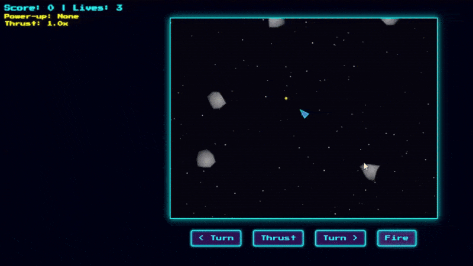

# 🚀 Asteroid Game Using HTML, CSS, and JavaScript

**By Faraz - April 04, 2025**  
A fun and simple Asteroid shooter game built using web technologies!  
Blast away asteroids, dodge collisions, and rack up points in this retro-style arcade game.  

## 🧠 Table of Contents

- [🎮 Project Introduction](#-project-introduction)
- [⚙️ Features](#️-features)
- [📦 Prerequisites](#-prerequisites)
- [📂 File Structure](#-file-structure)
- [🚀 How to Run](#-how-to-run)
- [🖥️ Preview](#️-preview)
- [📸 Screenshots](#-screenshots)
- [📜 License](#-license)

---

## 🎮 Project Introduction

Learn how to build a simple but engaging **Asteroid Game** using HTML, CSS, and JavaScript. This is a beginner-friendly game development project that demonstrates key game programming concepts like collision detection, player movement, shooting mechanics, and score tracking—all rendered inside an HTML5 canvas.

---

## ⚙️ Features

- 🔫 Player-controlled spaceship with shooting capabilities  
- 💥 Colliding asteroids that regenerate  
- 💯 Live score tracking  
- ❤️ Life tracking system  
- 🔁 Restart button  
- 🎮 On-screen button controls  
- 🎨 Retro-styled UI with pixel fonts and glowing visuals

---

## 📦 Prerequisites

Before starting, ensure you have the following:

- Basic understanding of **HTML, CSS, JavaScript**
- A code editor like **VS Code**
- A modern web browser (Chrome, Firefox, etc.)

---

## 📂 File Structure

